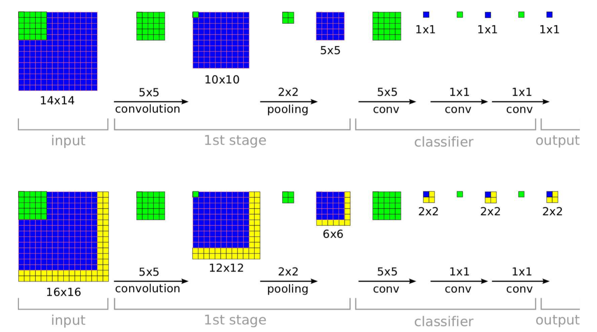
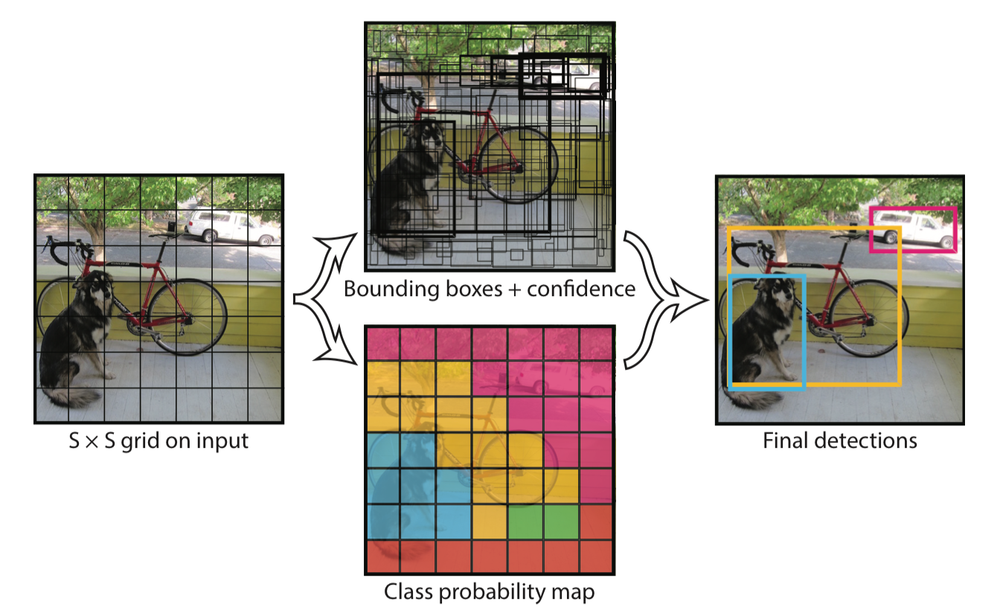

## YOLO ＆ 物體定位演算法簡介

YOLO 演算法在 Andrew Ng 的 [Coursera 課程](https://www.coursera.org/learn/convolutional-neural-networks/home/welcome)中有蠻詳細的介紹，不過對於實際上 training target 的設計我還是沒有非常了解，因此決定練習實作。由於這個專案還是進行當中，所以並沒有辦法立即得出完美的結果。

### 物體定位演算法

關於在物體影像上的識別可以分成以下三個目標：
- Object Classifcation：辨識圖片中的物體是什麼
- Object Detection：辨識某個物體是否出現在圖片中
- Object Localization：辨識圖片中的物體是什麼以及它的位置（bounding box）

從第一個目標到在最後兩個目標，很容易想到的方式是利用 sliding window，藉著改變 window 的大小和位置，配合 classification 的演算法就能知道物體是否出現以及物體出現在哪裡。不過直接套用 sliding window 是一個非常沒有效率的作法，因此在 2014 年 Pierre Sermanet 等在 OverFeat 這篇論文提出利用 Convolutional 的方式可以一次對整張圖計算不同位置的 sliding window，配合 CNN 的演算法就可以很有效率的進行物體的定位計算。

**OverFeat: the efficiency of ConvNets for Detection**

### YOLO: You Only Look Once（只需要一個 Neural Network）

引述作者在論文摘要寫的：
> ... Instead, we frame object detection as a regression problem to spatially separated bounding boxes and associated class probabilities.
> A single neural network predicts bounding boxes and class probabilities directly from full images in one evaluation.
> Since the whole detection pipeline is a single network, it can be optimized end-to-end directly on detection performance.

YOLO 是一個物體定位的演算法，由 Joseph Redmon, Santosh Divvala, Ross Girshick, Ali Farhadi 在 2015 年提出，並刊登在 CVPR 2016。
有別於過去的定位演算法在執行過程中需要經過多個 model（例如 R-CNN 需要先做 segmentation 再做 localization），YOLO 只用**單一類神經網路**就可以完成物體辨識和定位，因此可以加快執行的速度，而且也更容易優化。
在 2016 年的論文中作者提到 YOLO 可以達到 45 fps，而比較少層的類神經網路（Fast-YOLO）更可達到 150 fps，這讓實時（Real-time）的物體定位變得可能。

**YOLO 將圖片分區，並在不同區域中計算可能出現的物體和 bounding box**

[Back](../README.md)
