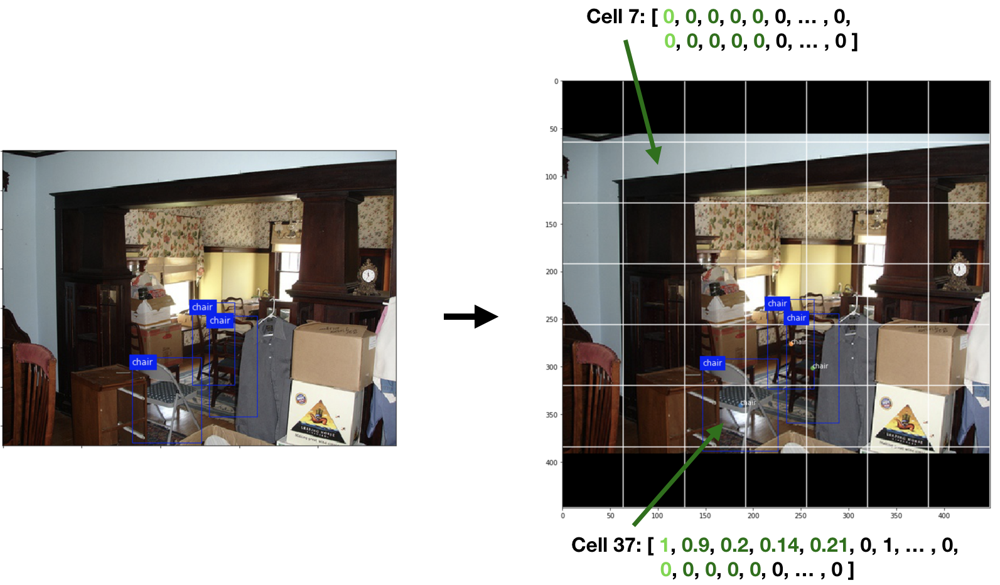
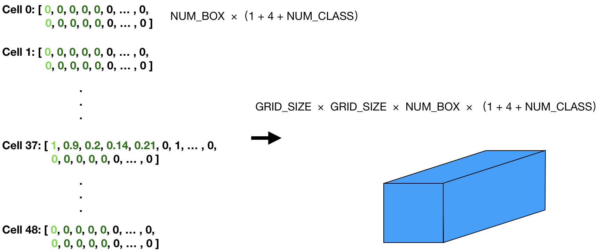

## 預處理 & Target Vector

### 概述




在 YOLO 的演算法中將圖片分成 7x7 的 Cell（YOLO 2 改成 19x19），並在每個區域中利用 Neural Network 預測物體在這個區域的可能性、bounding box 和物體的類別。在準備 training 資料時，每個物體只會被歸屬於包含它中心的 Cell 中，所以 target vector 可以以下圖的方式表達：





一個 target vector 可以拆成兩個描述物體的 bounding box，而每個 bounding box 可以拆成三個部分：
1. `label[0]`：confidence。代表具有 bounding box 的確定程度。對於 training 資料來說，如果沒有物體中心在 Cell 就是 0，反之為 1。
2. `label[1:2]`：bx, by。代表 bounding box 中心相對於 Cell 左上的座標，數值相對於 Cell 正規化，所以在 [0, 1] 之間。
3. `label[3:4]`：bw, bh。代表 bounding box 的長、寬，因為長寬有可能超過 Cell，因此數值相對於整張圖正規化，也是在 [0, 1] 之間。
4. `label[5:]`: c。代表物體屬於各個類別的可能性，總和為 1。YOLO1 和 YOLO2 分別有 20 和 80 種類別，所以長度分別為 20 和 80。

從 target vector 的設計可以知道所有的數值都在 [0, 1] 之間，所以 Neural Network 中最後的 activation 分別要對前五項和後幾項使用 sigmoid 和 softmax。另外因此 target vector 只包含兩個 bounding box，因此對於每一個 Cell，YOLO 最多只能感測到兩個物體，導致 YOLO 無法感測太過密集的物體，所以在 YOLO2 中將 Cell 數目提高到 19x19，並且增加 bounding box 的數目。

### 圖片預處理

將圖片預處理到 448 x 448，並在不足的部分補上黑邊或白邊，這裡可以利用 PIL.Image 的 paste：
```python
padded = Image.new("RGB", (model_dim, model_dim))
padded.paste(resized, box=((model_dim-new_w) // 2, (model_dim-new_h) // 2))
```

### Label 的預處理
原始 VOC2007 提供的資料是 xml 的格式：
```xml
<annotation>
  ...
	<object>
		<name>dog</name>
		<pose>Left</pose>
		<truncated>1</truncated>
		<difficult>0</difficult>
		<bndbox>
			<xmin>48</xmin>
			<ymin>240</ymin>
			<xmax>195</xmax>
			<ymax>371</ymax>
		</bndbox>
	</object>
  ...
</annotation>
```
可以藉著 YOLO 的 [voc_label.py](https://pjreddie.com/media/files/voc_label.py) 工具轉成
```python
# class_index, bx, by, bw, bh relative whole image
8 0.585 0.7306666666666667 0.122 0.3413333333333333
8 0.41600000000000004 0.8453333333333333 0.176 0.288
8 0.534 0.6546666666666666 0.108 0.27999999999999997
```

最終目標是改成 7 x 7 x 50 的矩陣，並利用 `numpy.save` 存成檔案以供後續使用
```
bboxs.shape = (7, 7, 50)
bboxs[0, 0, :] = [
  1.  ,  0.91,  0.31,  0.17,  0.22,  
  0.  ,  0.  ,  0.  ,  0.  ,  0.  ,  0.  ,  0.  ,  0.  ,  1.  ,  0.  ,
  0.  ,  0.  ,  0.  ,  0.  ,  0.  ,  0.  ,  0.  ,  0.  ,  0.  ,  0.  ,  

  0.  ,  0.  ,  0.  ,  0.  ,  0.  ,  
  0.  ,  0.  ,  0.  ,  0.  ,  0.  ,  0.  ,  0.  ,  0.  ,  1.  ,  0.  ,
  0.  ,  0.  ,  0.  ,  0.  ,  0.  ,  0.  ,  0.  ,  0.  ,  1.  ,  0.  ,
] 
```

[Back](../README.md)
