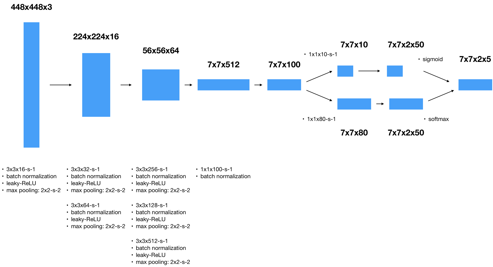
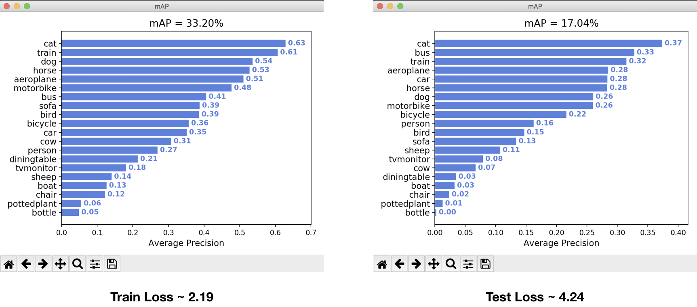

## Neurak Network model

### Network Overview

猶如前面提到的，模仿 OverFeat 我們可以用 Covolution 達到 sliding window 的效果。因此整個 network 必須具備以下的特性：
- 輸入：(m, 448, 448, 3)
- 輸出：(m, 7, 7, 2, 25) 也就是 (num_element, grid_size, grid_size, num_box, 5 + num_class)
- 輸出的所有元素都需要在 `[0, 1]` 之間 
- 輸出的最後一維的代表類別的 20 個元素總和為 1，因為代表機率

YOLO 在原始論文中建立的模型是 15 層 Conv layer 的架構，而在 YOLO2 中使用更深的模型並加入 Residual 的結構讓 back propagation 可以傳遞到底層（可以參考 [Deep Residual Network](https://arxiv.org/abs/1512.03385)）。不過太深的模型需要更多時間來訓練因此這裡我仿照論文建立 8 層的模型，如下：



程式碼部分可以參考 `src/yolo_tiny.py`

- 整個模型的涵義是將原始圖片切割成 cell，之後對每個 cell 利用 sliding window（所有的 3x3 convolution），再藉著 sliding window 的輸出預測 bounding box 的位置和物體的類別（之後的兩個 1x1 convolution）。
- batch normalization 是為了讓輸出維持在 `[0, 1]` 之間
- dropout layer 產生 blending 的效果，減少 overfit 的影響
- 1x1 kernel 被稱為 network in network，效果猶如對每個 channel 使用 fully-connected layer
- 最後 activation 分別對 bounding box 項用 sigmoid 控制在 `[0, 1]`；對類別項用 softmax 讓總和為 1，最後再疊合
- 由於目前使用 Keras 建立模型，為了計算 loss 必須將最後結果疊合，如果直接用 tensorflow 可以省去這一步


### 損失函數(Loss)

損失函數的設計是 YOLO 重要的部分。除了考量到分類的準確度（可以用 cross-entry error）和 bounding box 的形狀差異（可能用 mean square error），也需要考慮到 confidence 項，如果一個 bounding box 的 confidence 接近 0，這樣子後面的幾項的誤差就不重要，也就是說以下兩個的誤差應該表示成很小：
```python
y_true = [   0 ,    0 ,   0,    0,    0,   0,   0, ... , 0]
y_pred = [0.01 , 0.99, 0.99, 0.99, 0.99, 0.9, 0.1, ... , 0]
```
反之以下的應該要表示很大
```python
y_true = [   1 ,  0.1,  0.2,  0.2,  0.2,   1,   0, ... , 0]
y_pred = [0.01 ,  0.1,  0.2,  0.2,  0.2,   1,   0, ... , 0]
```

因此論文給出的誤差函數如下：


程式碼部分可以參考 `src/loss.py` 中的 `create_yolo_loss`


### Model：based on VGG16
由於直接訓練一個重頭建立的模型太花費時間，因此在深度學習中常常將已經建立好的模型當作基底，往上增加。可以想成這些已經建立好的模型預先幫後面的網路先做好 feature extraction，以利於後續的學習。這裡我利用 vgg 當作基底，往上增加。

- yolo_vgg_2: 由於原始的 vgg 輸入層為 (224, 224, 3)，因此採用自訂的輸入層接到 vgg 的第二層，並去除後面的 FC 層。讓 vgg 是可以被訓練的。
- yolo_vgg_3: 直接利用 vgg 的輸入層，但根據 vgg 的原始論文，輸入需要改成 BGR 的順序，並減去平均值，這個模型可訓練的部分只有 vgg 後面的網路。

### Training and Result

目前利用 VOC2007 和 VOC2012 的訓練資料作訓練，以 VOC2007 的測試資料作驗證，並在預處理時加上水平翻轉，因此總共的訓練影像數目約為 22000 張，驗證約為 5000 張。訓練時將全部的資料作 shuffle 並以 batch gradient descent(batch_size=64) 的方式訓練。

目前最好的結果利用 yolo_vgg2 的模型，可以得到 train loss ~ 2.19 時 valid loss ~ 4.24，兩者對應的 mAP 分別為 33.20% 與 17.04%，不算是足夠好的結果（Paper 中的 Fast Yolo 可以到 mAP ~ 52.7% 左右，YOLO 則有 63.4%），而且有嚴重的 overfitting，即便模型本身的 batch normalization 已經有一點 regularization 的效果，即使嘗試加上 L2 regularizer 後的的結果還是很不理想，問題應該出在訓練的資料還是太少（原始 11000 張，相當於每個物件類別只有 500 張），但利用 data argumentation 的方式增加訓練的資料量又會導致每次訓練的時間拉長，需要更好的運算資源才能處理。



[Back](../README.md)
